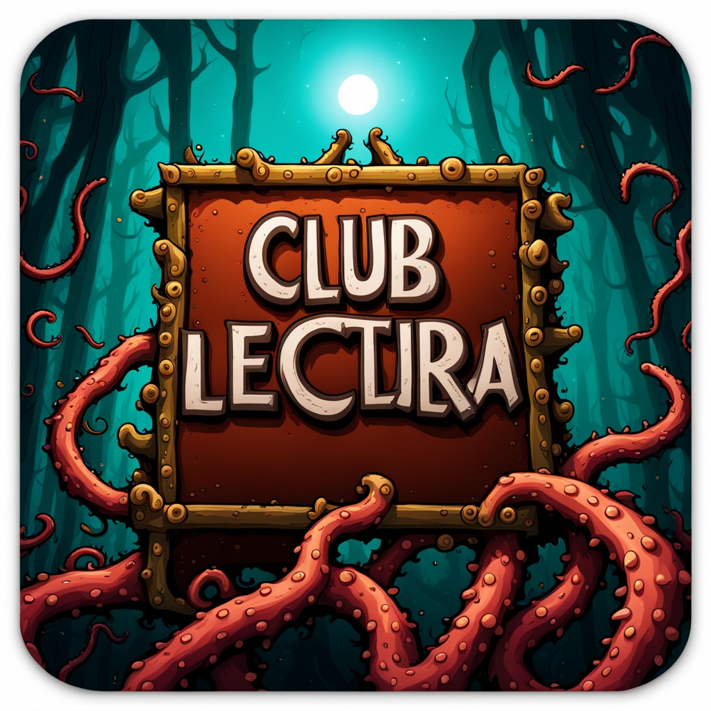

# Club de lectura
## Ramas

[Iteración 1: Modelos de datos](https://github.com/SyTW2324/E20/tree/iteracion01)

[Iteración 4 y 5: Integración continua y calidad del código](https://github.com/SyTW2324/E20/tree/iteracion04y05)

## Iteración 4 y 5

Para implementar las iteraciones 4 y 5 sin haber hecho las 2 y 3 he montado un placeholder que usa registro/login de usuario a través de MongoDB y permanencia de sesión usando JWT de forma muy rudimentaria, no será el que incluya en el proyecto final, solo lo estoy usando para salir del paso porque se me echa el tiempo encima.

## Ejecutando la aplicación

Para probar la aplicación disponiendo de MongoDB corriendo como servicio de forma local y sin autentificación no hay que modificar nada, la propia aplicación se encarga de conectarse y crear el esquema automáticamente, si está con autentificación debes modificar los archivos de configuración para incluir el nombre de usuario y contraseña de la BBDD MongoDB que quieras usar, después entra en la carpeta server y ejecutar primero `npm install` y posteriormente `npm start`, cuando terminas entras en la carpeta client y haces lo mismo. Una vez tienes el backend y el frontend funcionando en modo local accede a la dirección <a href="http://localhost:4200/" target="_blank">http://localhost:4200/</a> para probar la aplicación.

## Aplicación MEAN para la asignatura de Sistemas y Tecnologías Web (SYTW)

Este es el repositorio del proyecto final del equipo 20 de la asignatura de Sistemas y Tecnologías Web, del Grado de Ingeniería Informática de la Universidad de La Laguna.

La idea base del proyecto es una aplicación web que sirva para gestionar los clubes de lectura de la ULL e informar y poner en contacto a los usuari@s y moderadores de dichos clubes: creación de cuentas de usuari@, resúmenes de cada club, publicitar futuros clubes, etc.

## Implementación

La arquitectura que usaremos para implementar la aplicación será de stack MEAN con patrón de
diseño MVVM, interfaz REST, integración continua con Github Actions+Coveralls y desarrollo ágil con SCRUM.

MEAN:
- MongoDB como base de datos.
- Express.js como web framework.
- Angular como frontend.
- Node.js como backend.

MVVM:
- Modelo Vista Vista Modelo
- Útil cuando estás trabajando con datos dinámicos y quieres actualizar solo partes de la
página web.
- La impementación elegida para dicho patrón de diseño es Flux, y ya que no existe de forma
nativa en Angular usaremos la librería NgRx.
- Se intentará implementar la programación orientada a eventos (programación reactiva) a través del uso de la librería RxJS.

REST:
- Arquitectura de intercomunicación que sigue el protocolo HTTP.
- Se intentará desarrollar la aplicación compatible RESTful nivel 3, si no, se usará el 2.

JWT:
- Para la gestión de la sesión se usarán tokens JWT.

CI/CD y calidad del código:
- Para la integración continua y la calidad del código se usará Github Actions con Codecov.

Marco de trabajo:
- Usaremos SCRUM como sistema de desarrollo ágil de software, a través de Pivotal Tracker.

## Descargo de responsabilidad

Si usando esta aplicación invocas a Cthulhu, no es mi problema.